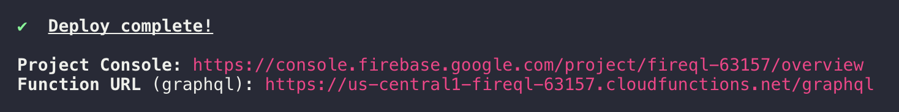
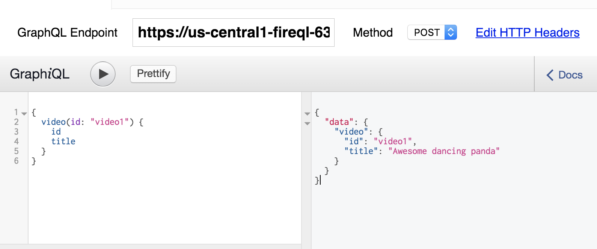

# 🔥 fireQL

> 🔥 Simple graphQL implementation on top of firebase cloud functions ☁️

## What!? Firebase & GraphQL? Why?

**TL;DR**: GraphQL shines where Firebase falls short. Powerful data modeling, flexible and efficient queries and the open specification are all essential parts of GraphQL that are lacking with Firebase.

### Powerful Data Modeling

Firebase has received a lot of criticism based on its limited data modeling. Basically, your data is structured as a single, huge JSON that states the same data multiple times. What seems convenient at first results in unmanageable client code whenever you need to update data, as you have to keep track of all the references to the same data manually.

The data structure used in GraphQL on the other hand is very intuitive and familiar to think about, as it is modelled as a graph. Using the IDL syntax we can easily describe our data model, called the GraphQL schema.

### Flexible and Efficient Queries

The flexible query capabilities of GraphQL is one its main benefits. Queries are hierarchical, that means you can specify data requirements that mirror the graph structure.

All of that is simply not possible with Firebase.

Extended explanation in **[stackoverflow](http://stackoverflow.com/a/42927556)**

## Deploying your graphQL function
```
firebase deploy --only functions
```




## Testing your graphQL queries



I recomend [graphiQL](https://github.com/graphql/graphiql)
> An in-browser IDE for exploring GraphQL.

You can get the desktop version [here](https://github.com/skevy/graphiql-app) or install via Homebrew:

```
brew cask install graphiql
```

Paste your function URL (you will see it after deploying your function) and star testing your grapQL queries
